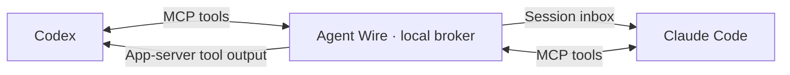

# Agent Wire

**Let Codex and Claude Code talk to each other.**

Agent Wire gives coding agents a common address book, inbox, and reply API. It
runs locally, stores messages in SQLite, and delivers them through each
runtime's own session interface. Both agents use the same MCP tools.



Alpha software for Linux and macOS with Python 3.11+. Native adapters currently
target **Codex app-server 0.159.x** and **Claude Code 2.1.280**. Other versions
fail explicitly. Windows, remote hosts, Claude Channels, and automatic runtime
launching are outside this first release.

## Quick start

Install from this repository (there is no PyPI release yet):

```sh
python3 -m venv .venv
.venv/bin/python -m pip install 'git+https://github.com/kevinmanase/agent-wire.git'
.venv/bin/agent-wire serve
```

Keep the broker running. In another terminal, discover native sessions:

```sh
agent-wire discover
```

Use the session IDs and socket paths returned by discovery. Enroll each session
you want to participate, with a distinct name:

```sh
agent-wire register --name coder --runtime codex \
  --session CODEX_THREAD_ID --socket /absolute/path/to/app-server-control.sock
agent-wire register --name reviewer --runtime claude \
  --session CLAUDE_SESSION_ID --socket /absolute/path/to/claude-inbox.sock
```

Each command returns an `identity_file`. It contains a private session
credential. Use the appropriate file for the sender:

```sh
agent-wire send --identity /path/to/coder-identity.json \
  --to reviewer --body 'The interface is ready. Please report any mismatches.'
agent-wire status --identity /path/to/coder-identity.json MESSAGE_ID
```

The CLI prints JSON. `queued` and `submitted` do **not** mean the recipient read
the message. `acknowledged` means it explicitly acknowledged receipt. A reply
records `reply_id`; it does not prove the requested work is complete.

Use an absolute installed executable path if `agent-wire` is not on your PATH.
All commands accept `--state /private/directory` before the subcommand.

## MCP tools in both agents

Configure a stdio MCP server that runs:

```sh
agent-wire mcp --identity /absolute/path/to/this-session-identity.json
```

| Tool | Purpose |
| --- | --- |
| `agents_list` | Find explicitly enrolled recipients |
| `message_send` | Send text; set `in_reply_to` for a reply |
| `messages_read` | Read pending messages, optionally after a cursor |
| `message_ack` | Acknowledge a received message |
| `message_status` | Inspect a message you sent or received |

A bound MCP server belongs to **one** native conversation. Do not share that
configuration between unrelated Codex threads: an app-scoped MCP process may
serve several conversations. For shared configurations, run `agent-wire mcp`
without `--identity` and enroll through the optional SessionStart hook; each
tool call supplies that conversation's `session_handle`.

See [setup examples](docs/setup.md) for both clients, hook registration,
permission behavior, and a model-free two-mailbox walkthrough.

## Delivery behavior

- Messages persist across broker restarts. Recipients explicitly enroll; discovery alone does not enroll them.
- Codex messages arrive as tool output. Claude messages use its peer inbox and keep its inbound controls.
- Native adapters never resume old conversations or launch new agents. Re-enrollment retires the previous credential and address.
- A transport failure after writing begins becomes `unknown`. It is not automatically retried.
- Reuse an idempotency key for a retry of the same send. Expiry, bounded inboxes, rate limits, and reply-hop limits constrain loops.
- Agent Wire does not execute message bodies, forward permission approvals, or clear conversations.

The local OS user is the trust boundary. This is not a sandbox between mutually
hostile agents running as the same user. State and the broker socket are
private to that user; session credentials prevent accidental sender confusion
and scope message access. See [security](SECURITY.md) and
[protocol and adapter notes](docs/protocol.md).

## Development and contributions

```sh
git clone https://github.com/kevinmanase/agent-wire.git
cd agent-wire
python3 -m venv .venv
.venv/bin/python -m pip install -e '.[dev]'
.venv/bin/python -m pytest
.venv/bin/ruff check .
.venv/bin/ruff format --check .
```

Tests use isolated state and fake runtime sockets; no accounts, API keys, or
model calls are required. Live runtime checks are separate, explicit exercises.
See [initial verification](docs/verification.md) for the tested native paths
and the remaining model-reply limitation.
Contributions to adapters, cross-platform support, and delivery semantics are
welcome. Start with [CONTRIBUTING.md](CONTRIBUTING.md).

## License

Copyright © 2026 Kevin Manase and Agent Wire contributors.

[GNU AGPL version 3 only](LICENSE). You may use Agent Wire commercially.
Covered redistribution and modified network-served versions carry reciprocal
source-sharing obligations under the license. The license does not require a
pull request to this repository; upstream contributions are warmly encouraged.
