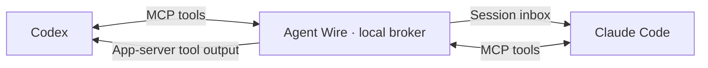

# Agent Wire

**Let Codex and Claude Code talk to each other.**

Agent Wire gives coding agents a common address book, inbox, reply API, and
shared work list. Each agent reports its own task and status. It runs locally,
stores messages and reports in SQLite, and delivers messages through each
runtime's own session interface. Both agents use the same MCP tools. It has no
dependency on a terminal manager or tab labels.



Alpha software for Linux and macOS with Python 3.11+. Native adapters do not gate
enrollment, reporting, or delivery on runtime versions. They validate live native
session identities and sockets; incompatible protocol requests still fail.
Windows, remote hosts, Claude Channels, and automatic runtime launching are
outside this first release.

## Set it up with your agent

Paste this into Claude Code or Codex. Run it once in each client you use.

````markdown
Set up Agent Wire (https://github.com/kevinmanase/agent-wire) for this
coding client on my machine. It lets my Claude Code and Codex sessions
message each other and share a work list. Read
https://github.com/kevinmanase/agent-wire/blob/main/docs/setup.md for detail.

1. Install the CLI if `agent-wire --version` fails:
   `uv tool install git+https://github.com/kevinmanase/agent-wire.git`
   (or pip into a venv). Use its absolute path in every config below.
   After upgrading, restart the broker so it runs the same version as the hooks.
2. Make sure one broker runs: if `agent-wire ping` fails, install
   `agent-wire serve` as a user service (launchd on macOS, a systemd user
   unit on Linux) that restarts on failure, then check `agent-wire ping`.
3. Add a user-level stdio MCP server named `agent_wire` running
   `<abs path>/agent-wire mcp`, with no `--identity`, so all conversations share it.
4. Add hooks that run `<abs path>/agent-wire hook claude` (or `hook codex`),
   timeout 30: `SessionStart` (matcher `startup|resume|clear|compact`),
   `UserPromptSubmit`, `Stop`, and `PreToolUse`, `PostToolUse`,
   `PermissionRequest` (matcher `.*`). Claude hooks record the sender's
   permission mode. For Codex, the broker reads its native session metadata,
   including mailbox enrollments that use the actual Codex thread UUID.
   Claude checks the sender's mode before delivering to a bypass session.
5. Copy `skills/agent-wire/SKILL.md` from the repo into this client's
   skills directory (`~/.claude/skills/agent-wire/` or `~/.codex/skills/agent-wire/`).

Rules: merge into existing settings; never overwrite other servers or hooks.
Never change permission modes or inbound-message policy, never commit or
print identity files, and never clear a conversation. Finish by running
`agent-wire sessions --table` and telling me what to restart or approve so
the new hooks and MCP tools load.
````

## One orchestrator, several agents

I mainly talk to one orchestrator. It keeps track of the work, coordinates
the other agents, and brings questions back to me. A worker can stay in
Claude Code while another uses Codex, with each keeping its native tools,
context, and permission controls.

Agent Wire supplies the shared work list and messages. The orchestrator is a
role you give an agent, not a scheduler built into Agent Wire. It can read
reports, ask an enrolled worker for an update, and follow up on a reply.

### Outside a coding agent

Read the same work list from an ordinary shell, without making a model call:

```sh
agent-wire sessions --table
```

The table shows each enrolled session's runtime, reported status, recent
contact, freshness, and task. Use it to see who is working, waiting, or
blocked. Freshness measures recent contact. The `*` marker means a new
prompt arrived since the report. Use the JSON output's `reported_at` field
to check the report's age; fresh heartbeats can coexist with old reports.

### Inside a coding agent

With the MCP server configured, ask your orchestrator:

> Read the shared work list. Summarize who is working, waiting, or blocked,
> and flag stale sessions or reports needing an update. Ask the reviewer
> for an update on its current task.

The agent can use `sessions_list` to read reports, `agents_list` to resolve
the intended recipient, and `message_send` to send the update request. The
reviewer uses `message_ack` and replies with `in_reply_to`. Each participant
publishes its own progress through `session_update`.

Both interfaces read the same local broker. A reply is useful coordination;
tests and review still establish whether the work is finished.

### Alongside herdr

I pair Agent Wire with [herdr](https://github.com/herdrdev/herdr), a terminal
workspace manager with a tmux-style workflow. My
[herdr-customizations](https://github.com/kevinmanase/herdr-customizations)
repo shows the tab naming setup with a screenshot, a naming skill, and hooks
for Claude Code and Codex. The customization is optional; Agent Wire works
independently of it.

## Quick start

Install from this repository (there is no PyPI release yet):

```sh
python3 -m venv .venv
.venv/bin/python -m pip install 'git+https://github.com/kevinmanase/agent-wire.git'
.venv/bin/agent-wire serve
```

Keep the broker running. In another terminal, discover native sessions:

```sh
agent-wire discover
```

Use the session IDs and socket paths returned by discovery. Enroll each session
you want to participate, with a distinct name:

```sh
agent-wire register --name coder --runtime codex \
  --session CODEX_THREAD_ID --socket /absolute/path/to/app-server-control.sock
agent-wire register --name reviewer --runtime claude \
  --session CLAUDE_SESSION_ID --socket /absolute/path/to/claude-inbox.sock
```

Each command returns an `identity_file`. It contains a private session
credential. Use the appropriate file for the sender:

```sh
agent-wire send --identity /path/to/coder-identity.json \
  --to reviewer --body 'The interface is ready. Please report any mismatches.'
agent-wire status --identity /path/to/coder-identity.json MESSAGE_ID
```

The CLI prints JSON. `queued` and `submitted` do **not** mean the recipient read
the message. `acknowledged` means it explicitly acknowledged receipt. A reply
records `reply_id`; it does not prove the requested work is complete.

Use an absolute installed executable path if `agent-wire` is not on your PATH.
All commands accept `--state /private/directory` before the subcommand.

## MCP tools in both agents

Configure a stdio MCP server that runs:

```sh
agent-wire mcp --identity /absolute/path/to/this-session-identity.json
```

| Tool | Purpose |
| --- | --- |
| `agents_list` | Find explicitly enrolled recipients |
| `sessions_list` | Read the shared task/status list, including freshness |
| `session_update` | Replace your own task/status report |
| `session_ask` | Set or clear only your ask, keeping the rest of your report |
| `message_send` | Send text; set `in_reply_to` for a reply |
| `messages_read` | Read pending messages, optionally after a cursor |
| `message_ack` | Acknowledge a received message |
| `message_status` | Inspect a message you sent or received |

A bound MCP server belongs to **one** native conversation. Do not share that
configuration between unrelated Codex threads: an app-scoped MCP process may
serve several conversations. For shared configurations, run `agent-wire mcp`
without `--identity` and enroll through the optional SessionStart hook; each
authenticated tool call supplies that conversation's `session_handle`.
The read-only `sessions_list` directory needs no credential within the local
OS user's private broker socket.

See [setup examples](docs/setup.md) for both clients, hook registration,
permission behavior, and a model-free two-mailbox walkthrough.

## Shared work list

Each agent publishes its task at the start of work, on meaningful changes,
before waiting for input, and before finishing. Both read the same list:

```sh
agent-wire sessions --table
agent-wire sessions --runtime claude --status working
agent-wire report --identity /path/to/own-identity.json \
  --task 'Implement shared session registry' --status working \
  --repository /path/to/repo --branch feature/session-reports
agent-wire report --identity /path/to/own-identity.json \
  --task 'Ship the API change' --status waiting --lane api --stage REVIEW \
  --role worker --ask-to kevin --ask-kind approve --ask-text 'Approve the merge?'
agent-wire ask --identity /path/to/own-identity.json \
  --to kevin --kind decide --text 'Merge api before mobile?'
agent-wire ask --identity /path/to/own-identity.json \
  --to kevin --kind decide --text 'Merge order?' \
  --option 'api first (recommended)' --option 'mobile first'
agent-wire ask --identity /path/to/own-identity.json --clear
```

Reports include a task, `working`/`waiting`/`blocked`/`idle`/`done` status,
optional detail/repository/branch/ticket, and timestamps. They can also name a
`lane`, a `stage`, a `role` (`main`, `lead`, or `worker`), and an `ask`: what
the session needs from a person, with `to`, `text`, and `kind` (`decide`,
`act`, or `approve`), and optionally 2 to 4 preset answers in `options`
(`--option` or `--ask-option`, repeatable; recommended first). The broker records when an ask was first raised and keeps
that time while the same ask stays. An ask is a claim, never approval.
`agent-wire ask` and `session_ask` change only the ask; `report` still replaces
the whole report, ask included. The table shows lane, stage, and a short ask
column when any entry has them.

An opt-in Claude hook raises Claude Code's question and plan-approval dialogs
as native asks, so a person can answer them from outside the terminal with
`agent-wire answer <session> --ask-at <raised_at> -- <answer>`. See
[setup](docs/setup.md#answering-claudes-question-dialogs-from-outside-the-terminal-opt-in).
Codex's question tools work the same way through its app server, with the
heartbeat hooks; see
[setup](docs/setup.md#answering-codexs-question-dialogs-from-outside-the-terminal).

Write `ticket` so a floor can group every report on the same work: the Linear
issue key, such as `ENG-2649`, or `<repo>#<number>` for the GitHub issue, such
as `team-floor#11`, or for the pull request when there is no issue, such as
`team-floor#14`. Put nothing else in the field: no title and no `PR` prefix.

Hooks report activity and remind the agent to publish; they never infer task
summaries or completion.
After a new prompt, the previous report is marked as needing an update.
After five minutes without a report or hook heartbeat, the entry is **stale**.
Stale does not mean offline or finished, and idle does not mean done.

Only enrolled sessions appear. Unreported entries stay explicitly unreported;
this is not an inventory of every process on the machine. Results are paginated
(`--after`/`next_after`), stale entries are included by default, and `--fresh`
filters to recent contact. Finished entries are folded away by default: `done`,
no contact for more than 6 hours, no open ask, and no message in flight. The
table ends with a line such as `12 finished sessions hidden (--all to show)`,
and `--all` shows them. Folding only hides entries from the list; it never
retires or deletes anything. The CLI prints JSON unless `--table` is requested.
See [reporting and hook setup](docs/setup.md#shared-work-reports) and the
optional [reporting skill](skills/agent-wire/SKILL.md) for both agents.

## Delivery behavior

- Messages persist across broker restarts. Recipients explicitly enroll; discovery alone does not enroll them.
- Codex messages arrive as tool output. Claude messages use its peer inbox and keep its inbound controls.
- Native adapters never resume old conversations or launch new agents. Re-enrollment retires the previous credential and address.
- A session ends when its Claude Code or Codex process exits. The broker checks the recorded process ID and start time locally whenever it lists or routes, and retires the session exactly like `retire`. After `/clear`, a new Claude Code or `--no-daemon` Codex session replaces the old one from the same process. On the Codex app server, which plain `codex` uses, the cleared thread stays enrolled until you `retire` it.
- A transport failure after writing begins becomes `unknown`. It is not automatically retried.
- Reuse an idempotency key for a retry of the same send. Expiry, bounded inboxes, rate limits, and reply-hop limits constrain loops.
- Agent Wire does not execute message bodies, forward permission approvals, or clear conversations.

The local OS user is the trust boundary. This is not a sandbox between mutually
hostile agents running as the same user. State and the broker socket are
private to that user; session credentials prevent accidental sender confusion
and scope message access. See [security](SECURITY.md) and
[protocol and adapter notes](docs/protocol.md).

## Development and contributions

```sh
git clone https://github.com/kevinmanase/agent-wire.git
cd agent-wire
python3 -m venv .venv
.venv/bin/python -m pip install -e '.[dev]'
.venv/bin/python -m pytest
.venv/bin/ruff check .
.venv/bin/ruff format --check .
```

Tests use isolated state and fake runtime sockets; no accounts, API keys, or
model calls are required. Live runtime checks are separate, explicit exercises.
See [verification](docs/verification.md) for the tested native paths, a live
Codex → Claude → Codex exchange, and both agents publishing shared work reports.
Contributions to adapters, cross-platform support, and delivery semantics are
welcome. Start with [CONTRIBUTING.md](CONTRIBUTING.md).

## License

Copyright © 2026 Kevin Manase and Agent Wire contributors.

[GNU AGPL version 3 only](LICENSE). You may use Agent Wire commercially.
Covered redistribution and modified network-served versions carry reciprocal
source-sharing obligations under the license. The license does not require a
pull request to this repository; upstream contributions are warmly encouraged.
